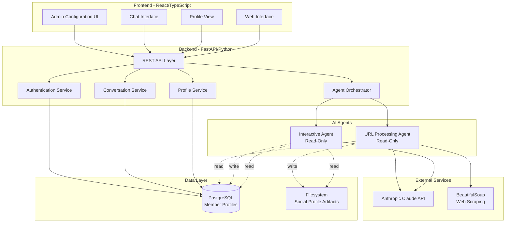
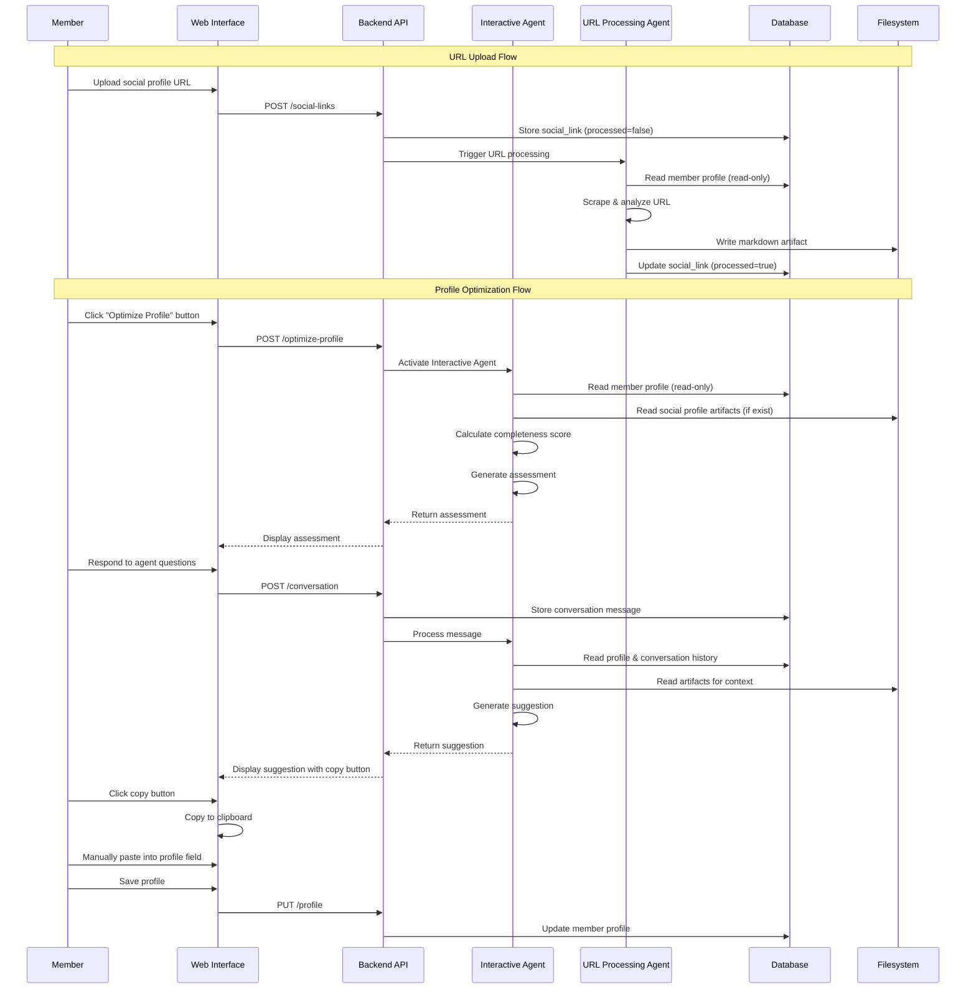

# Design Document - Profile Optimizer System

## Overview

The Profile Optimizer System is a dual-agent AI architecture designed to enrich member profile data for the White Rabbit Ashland community. The system consists of two independent agents that operate asynchronously:

1. **URL Processing Agent**: Event-driven agent that analyzes social profile URLs and generates markdown artifacts
2. **Interactive Agent**: User-activated conversational agent that assesses profiles and provides optimization suggestions

Both agents operate in read-only mode with respect to member profile data, maintaining strict ethical boundaries. The Interactive Agent provides copy-to-clipboard suggestions that members manually apply to their profiles.

## Architecture

### High-Level System Architecture



### Agent Interaction Flow



## Components and Interfaces

### 1. Frontend Components

#### Web Interface (React/TypeScript)

**ProfileOptimizerButton Component**
- Renders "Optimize Profile" button on member profile page
- Triggers Interactive Agent activation
- Props: `memberId`, `onActivate`

**ChatInterface Component**
- Displays conversation with Interactive Agent
- Shows assessment results
- Renders suggestions with copy-to-clipboard buttons
- Props: `sessionId`, `messages`, `onSendMessage`

**CopyToClipboardButton Component**
- Renders copy button next to each suggestion
- Copies suggestion text to system clipboard
- Shows visual feedback on successful copy
- Props: `text`, `label`

**AdminConfigPanel Component**
- Tabbed interface for admin configuration
- Tabs: Assessment Criteria, Interactive Agent Prompt, URL Agent Prompt, Extraction Criteria
- Props: `adminRole`, `onSave`

**MockMembershipForm Component**
- Testing interface that mirrors production membership form
- Includes all profile fields with individual "Populate Field" buttons
- Provides "Populate Random Profile" and "Clear All" buttons
- Writes directly to mock database for testing
- Props: `memberId`, `onSave`, `onClear`

**PopulateFieldButton Component**
- Renders next to each form field
- Generates realistic fake data for that specific field
- Visual indicator when field is auto-populated
- Props: `fieldName`, `fieldType`, `onPopulate`

**AssessmentCriteriaEditor Component**
- Form for configuring field weights and thresholds
- Real-time preview of score changes
- Props: `criteria`, `onUpdate`, `memberProfiles`

**SystemPromptEditor Component**
- Multi-line text editor with syntax highlighting
- Version history viewer
- Test mode with sample inputs
- Props: `agentType`, `currentPrompt`, `onSave`

**ExtractionCriteriaEditor Component**
- Checkboxes for data categories
- Custom instruction fields
- Markdown template editor
- Test mode with sample URL
- Props: `criteria`, `onUpdate`

#### State Management (TanStack Query)

**Queries:**
- `useProfile(memberId)` - Fetch member profile
- `useConversation(sessionId)` - Fetch conversation history
- `useAssessmentCriteria()` - Fetch admin configuration
- `useSystemPrompt(agentType)` - Fetch agent system prompt
- `useExtractionCriteria()` - Fetch URL agent config

**Mutations:**
- `useOptimizeProfile()` - Activate Interactive Agent
- `useSendMessage()` - Send conversation message
- `useUpdateProfile()` - Update member profile
- `useUploadSocialLink()` - Upload social profile URL
- `useUpdateCriteria()` - Update assessment criteria
- `useUpdateSystemPrompt()` - Update agent prompt
- `useUpdateExtractionCriteria()` - Update extraction config
- `usePopulateField()` - Generate fake data for a field
- `usePopulateRandomProfile()` - Generate partial fake profile
- `useClearMockProfile()` - Clear all mock form fields

#### Mock Membership Form (Testing Interface)

The Mock Membership Form is a testing tool that mirrors the production membership form structure, allowing developers to quickly create synthetic test profiles with varying completeness levels.

**Form Structure (Based on Production Form):**

The form is organized into sections matching the production membership interface:

**Section 1: Basic Information**
- Profile photo upload (circular avatar)
- First name (text input)
- Last name (text input)
- What you do (text input) - free-form description
- Where (text input) - location

**Section 2: Links & Contact**
- Phone number (text input with format validation)
- Website (URL input)
- Social links (repeatable URL inputs with Add/Remove buttons)
  - Supports multiple platforms: LinkedIn, Twitter, GitHub, etc.

**Section 3: Traits - My Skills**
- Multi-select tag/chip input
- Prompt: "What are you good at? Add at least one."
- Add button to create new skill tags
- Remove (X) button on each tag

**Section 4: Traits - My Interests**
- Multi-select tag/chip input
- Prompt: "What are you passionate or curious about?"
- Add button to create new interest tags
- Remove (X) button on each tag

**Section 5: Traits - My Inspirations**
- Multi-select tag/chip input
- Prompt: "What people, books, or ideas inspire you?"
- Add button to create new inspiration tags
- Remove (X) button on each tag

**Section 6: Prompt Responses**
- **Current Focus** (textarea)
  - Prompt: "What is your current focus?"
  - Subtext: "What are you currently working on or creating?"
  - Character counter
  
- **Needs for Vision** (textarea)
  - Prompt: "What do you need to realize your vision?"
  - Subtext: "Who or what do you need that is holding you back from achieving your creative goals?"
  - Character counter
  
- **Motivations** (textarea)
  - Prompt: "What motivates you?"
  - Subtext: "What are your personal, artistic, and/or professional goals? What drives you to create and achieve?"
  - Character counter

**Testing Features:**

Each field includes a "Populate Field" button (⚡ icon) that:
- Generates realistic fake data appropriate for that field type
- Uses libraries like Faker.js for names, locations, URLs
- Uses predefined lists for skills, interests, inspirations
- Generates contextually appropriate text for prompt responses

**Utility Buttons:**
- **Populate Random Profile** - Randomly fills 30-90% of fields to simulate a wide range of profile completeness levels
- **Clear All** - Resets all fields to empty state
- **Save Profile** - Writes data to mock database
- **View Assessment** - Triggers Interactive Agent assessment on current profile state

**Data Generation Examples:**

```typescript
// Field-specific fake data generators
const fieldGenerators = {
  first_name: () => faker.person.firstName(),
  last_name: () => faker.person.lastName(),
  what_you_do: () => faker.helpers.arrayElement([
    'Software Engineering, Product Design',
    'Research, Analysis, Systems Design',
    'Creative Writing, Content Strategy',
    'Data Science, Machine Learning'
  ]),
  where_location: () => faker.location.city() + ', ' + faker.location.state(),
  phone_number: () => faker.phone.number('(###) ###-####'),
  website: () => 'https://' + faker.internet.domainName(),
  
  skills: () => faker.helpers.arrayElements([
    'Research', 'Systems design', 'Data Design', 'Python',
    'React', 'Machine Learning', 'UX Design', 'Writing'
  ], { min: 2, max: 5 }),
  
  interests: () => faker.helpers.arrayElements([
    'AI Ethics', 'Semiotics', 'Democracy', 'Biosemiotics',
    'Systems Thinking', 'Philosophy', 'Technology'
  ], { min: 2, max: 6 }),
  
  inspirations: () => faker.helpers.arrayElements([
    'Michel Foucault', 'Charles Peirce', 'Donna Haraway',
    'Ursula K. Le Guin', 'Alan Kay', 'Jane Jacobs'
  ], { min: 1, max: 4 }),
  
  current_focus: () => faker.lorem.paragraph(3),
  needs_for_vision: () => faker.lorem.paragraph(2),
  motivations: () => faker.lorem.paragraph(4)
};
```

**Testing Workflow:**

1. Developer navigates to `/test/mock-profile`
2. Selectively clicks "Populate Field" buttons to create specific test scenarios:
   - Empty profile (no fields populated)
   - Minimal profile (only required fields)
   - Partial profile (some sections complete, others empty)
   - Nearly complete profile (one or two fields missing)
   - Complete profile (all fields populated)
3. Clicks "Save Profile" to write to database
4. Clicks "Optimize Profile" button to activate Interactive Agent
5. Observes how agent assessment changes based on profile completeness
6. Modifies fields and saves again to test context updates

### 2. Backend Services

#### REST API Endpoints

**Profile Management**
```
GET    /api/profiles/{member_id}
PUT    /api/profiles/{member_id}
GET    /api/profiles/{member_id}/completeness
```

**Social Links**
```
POST   /api/profiles/{member_id}/social-links
GET    /api/profiles/{member_id}/social-links
DELETE /api/social-links/{link_id}
```

**Interactive Agent**
```
POST   /api/agent/optimize-profile
POST   /api/agent/conversation
GET    /api/agent/conversation/{session_id}
```

**URL Processing Agent**
```
POST   /api/agent/process-url
GET    /api/agent/artifacts/{member_id}
```

**Admin Configuration**
```
GET    /api/admin/assessment-criteria
PUT    /api/admin/assessment-criteria
GET    /api/admin/system-prompt/{agent_type}
PUT    /api/admin/system-prompt/{agent_type}
GET    /api/admin/extraction-criteria
PUT    /api/admin/extraction-criteria
POST   /api/admin/test-prompt
POST   /api/admin/test-extraction
```

**Testing & Mock Data**
```
GET    /api/test/mock-profile/{member_id}
POST   /api/test/mock-profile
PUT    /api/test/mock-profile/{member_id}
DELETE /api/test/mock-profile/{member_id}
POST   /api/test/populate-field
POST   /api/test/populate-random-profile
POST   /api/test/clear-profile/{member_id}
```

#### Service Layer Architecture

**ProfileService**
- `get_profile(member_id)` - Retrieve member profile
- `update_profile(member_id, data)` - Update profile fields
- `calculate_completeness(member_id)` - Calculate completeness score
- `get_missing_fields(member_id)` - Identify gaps

**ConversationService**
- `create_session(member_id)` - Start new conversation
- `add_message(session_id, role, content)` - Store message
- `get_history(session_id)` - Retrieve conversation
- `get_context(member_id)` - Get relevant context for agent

**SocialLinkService**
- `add_social_link(member_id, url, platform)` - Store URL
- `mark_processed(link_id)` - Update processing status
- `get_unprocessed_links()` - Queue for URL agent

**ArtifactService**
- `save_artifact(member_id, platform, content)` - Write markdown file
- `get_artifacts(member_id)` - Read member's artifacts
- `list_artifacts()` - List all artifacts
- `get_artifact_path(member_id, platform)` - Construct file path

**ConfigService**
- `get_assessment_criteria()` - Load criteria config
- `update_assessment_criteria(criteria)` - Save criteria
- `get_system_prompt(agent_type)` - Load agent prompt
- `update_system_prompt(agent_type, prompt)` - Save prompt
- `get_extraction_criteria()` - Load extraction config
- `update_extraction_criteria(criteria)` - Save config

**MockDataService**
- `generate_field_data(field_name, field_type)` - Generate fake data for specific field
- `generate_random_profile(completeness_range)` - Generate partial profile (30-90% complete)
- `clear_profile(member_id)` - Clear all fields for test profile
- `save_mock_profile(member_id, data)` - Write test data to database
- `get_mock_profile(member_id)` - Retrieve test profile

### 3. AI Agent Architecture

#### Interactive Agent

**Core Responsibilities:**
1. Profile assessment and completeness scoring
2. Conversational interview based on gaps
3. Suggestion generation with copy-to-clipboard format
4. Context synthesis from profile, conversation, and artifacts

**Agent Structure:**
```python
class InteractiveAgent:
    def __init__(self, claude_client, config_service):
        self.claude = claude_client
        self.config = config_service
        
    def assess_profile(self, member_id):
        """Calculate completeness score and identify gaps"""
        profile = self.profile_service.get_profile(member_id)
        criteria = self.config.get_assessment_criteria()
        
        score = self._calculate_score(profile, criteria)
        gaps = self._identify_gaps(profile, criteria)
        priorities = self._prioritize_gaps(gaps, criteria)
        
        return {
            'score': score,
            'gaps': gaps,
            'priorities': priorities,
            'assessment_message': self._generate_assessment_message(score, priorities)
        }
    
    def generate_suggestion(self, member_id, session_id, field_name):
        """Generate profile suggestion based on conversation and artifacts"""
        profile = self.profile_service.get_profile(member_id)
        conversation = self.conversation_service.get_history(session_id)
        artifacts = self.artifact_service.get_artifacts(member_id)
        system_prompt = self.config.get_system_prompt('interactive')
        
        context = self._build_context(profile, conversation, artifacts)
        
        response = self.claude.messages.create(
            model="claude-3-5-sonnet-20241022",
            system=system_prompt,
            messages=[
                {"role": "user", "content": self._format_suggestion_prompt(field_name, context)}
            ]
        )
        
        return {
            'field': field_name,
            'suggestion': response.content[0].text,
            'sources': self._identify_sources(artifacts, conversation)
        }
    
    def _build_context(self, profile, conversation, artifacts):
        """Synthesize context from multiple sources"""
        context = {
            'current_profile': profile,
            'conversation_history': conversation,
            'social_artifacts': {}
        }
        
        for artifact in artifacts:
            platform = artifact['platform']
            content = self.artifact_service.read_artifact(artifact['path'])
            context['social_artifacts'][platform] = self._parse_artifact(content)
        
        return context
```

**System Prompt Structure:**
```
You are the White Rabbit Profile Optimizer, an AI assistant helping community members build rich, complete profiles.

Your role:
- Assess profile completeness and identify gaps
- Ask targeted questions based on missing information
- Generate suggestions for profile fields
- Synthesize information from conversation and social profile artifacts
- Respect privacy and ethical boundaries

Guidelines:
- Always explain why information is valuable for community collaboration
- Cite sources when using information from social profiles
- Never suggest sensitive information for public profiles
- Provide suggestions in copy-ready format
- Be conversational and supportive

Current assessment criteria:
{criteria}

Member context:
{profile_data}
{artifacts_summary}
```

#### URL Processing Agent

**Core Responsibilities:**
1. Scrape and analyze social profile URLs
2. Extract schema-relevant data only
3. Generate structured markdown artifacts
4. Respect privacy and ethical constraints

**Agent Structure:**
```python
class URLProcessingAgent:
    def __init__(self, claude_client, config_service):
        self.claude = claude_client
        self.config = config_service
        self.scraper = BeautifulSoup
        
    def process_url(self, social_link_id):
        """Process social profile URL and generate artifact"""
        link = self.social_link_service.get_link(social_link_id)
        member = self.profile_service.get_profile(link['member_id'])
        extraction_criteria = self.config.get_extraction_criteria()
        system_prompt = self.config.get_system_prompt('url_processing')
        
        # Scrape URL content
        html_content = self._scrape_url(link['url'])
        
        # Extract relevant data using Claude
        response = self.claude.messages.create(
            model="claude-3-5-sonnet-20241022",
            system=system_prompt,
            messages=[
                {"role": "user", "content": self._format_extraction_prompt(
                    html_content, 
                    extraction_criteria,
                    link['platform_name']
                )}
            ]
        )
        
        extracted_data = self._parse_extraction_response(response.content[0].text)
        
        # Generate markdown artifact
        artifact_content = self._generate_markdown(
            member,
            link,
            extracted_data,
            extraction_criteria['template']
        )
        
        # Save to filesystem
        artifact_path = self.artifact_service.save_artifact(
            member['id'],
            link['platform_name'],
            artifact_content
        )
        
        # Mark as processed
        self.social_link_service.mark_processed(social_link_id)
        
        return artifact_path
    
    def _generate_markdown(self, member, link, data, template):
        """Generate markdown artifact from extracted data"""
        return f"""# Social Profile: {link['platform_name'].title()}

**Member:** {member['first_name']} {member['last_name']}
**Platform:** {link['platform_name']}
**Profile URL:** {link['url']}
**Extracted:** {datetime.utcnow().isoformat()}

## Skills
{self._format_list(data.get('skills', []))}

## Interests
{self._format_list(data.get('interests', []))}

## Professional Focus
{data.get('professional_focus', 'Not available')}

## Location
{data.get('location', 'Not specified')}

## Goals & Motivations
{data.get('goals', 'Not available')}
"""
```

**System Prompt Structure:**
```
You are a data extraction agent for the White Rabbit Profile Optimizer.

Your task:
- Extract ONLY the following data from social profiles: {enabled_categories}
- Map extracted data to database schema fields
- Respect privacy - do not extract contact info, private messages, or sensitive data
- Output structured JSON for markdown generation

Extraction criteria:
{extraction_criteria}

Output format:
{
  "skills": ["skill1", "skill2"],
  "interests": ["interest1", "interest2"],
  "professional_focus": "description",
  "location": "city, state/country",
  "goals": "stated goals or motivations"
}
```

## Data Models

### Database Schema

See #[[file:database-schema.md]] for complete schema definition.

**Key Tables:**
- `members` - Core profile data
- `social_links` - Social profile URLs with processing status
- `skills`, `interests`, `inspirations` - Normalized trait data
- `member_skills`, `member_interests`, `member_inspirations` - Junction tables
- `prompt_responses` - Long-form text responses
- `conversation_history` - Agent conversation logs
- `profile_completeness` - Cached completeness scores

### Filesystem Structure

**Social Profile Artifacts:**
```
/artifacts/
  /social_profiles/
    /{member_id}/
      {member_id}_socialprofile_linkedin.md
      {member_id}_socialprofile_twitter.md
      {member_id}_socialprofile_github.md
```

**Configuration Files:**
```
/config/
  assessment_criteria.json
  interactive_agent_prompt.txt
  url_agent_prompt.txt
  extraction_criteria.json
```

### Configuration Data Models

**Assessment Criteria:**
```json
{
  "field_weights": {
    "first_name": 5,
    "last_name": 5,
    "what_you_do": 15,
    "location": 5,
    "skills": 20,
    "interests": 15,
    "inspirations": 10,
    "current_focus": 10,
    "needs_for_vision": 10,
    "motivations": 5
  },
  "quality_thresholds": {
    "what_you_do": {"min_chars": 50},
    "current_focus": {"min_chars": 100},
    "needs_for_vision": {"min_chars": 100},
    "motivations": {"min_chars": 100}
  },
  "field_requirements": {
    "first_name": "required",
    "last_name": "required",
    "what_you_do": "required",
    "skills": "required",
    "interests": "recommended",
    "inspirations": "optional",
    "current_focus": "recommended",
    "needs_for_vision": "recommended",
    "motivations": "optional"
  }
}
```

**Extraction Criteria:**
```json
{
  "enabled_categories": ["skills", "interests", "professional_focus", "location", "goals"],
  "custom_instructions": {
    "skills": "Extract technical skills, tools, and methodologies",
    "interests": "Extract topics, domains, and areas of curiosity",
    "professional_focus": "Summarize current work and projects",
    "location": "Extract city and state/country only",
    "goals": "Extract stated career or creative goals"
  },
  "template": "standard_markdown"
}
```

## Error Handling

### Agent Error Scenarios

**Interactive Agent:**
1. **Profile not found** - Return error message, suggest profile creation
2. **Claude API failure** - Retry with exponential backoff, fallback to cached suggestions
3. **Artifact read failure** - Continue without artifact context, log warning
4. **Invalid conversation state** - Reset session, start fresh assessment

**URL Processing Agent:**
1. **URL scraping failure** - Mark as failed, notify admin, retry after delay
2. **Claude API failure** - Retry with exponential backoff, queue for later processing
3. **Invalid URL format** - Return validation error to user
4. **Filesystem write failure** - Log error, retry, notify admin if persistent

### Database Error Handling

- **Connection failures** - Retry with exponential backoff, circuit breaker pattern
- **Transaction failures** - Rollback, log error, return user-friendly message
- **Constraint violations** - Validate before insert, return specific error messages

### Frontend Error Handling

- **API failures** - Display user-friendly error messages, retry button
- **Network timeouts** - Show loading state, timeout after 30 seconds
- **Clipboard API failures** - Fallback to manual text selection

## Testing Strategy

### Unit Tests

**Backend Services:**
- ProfileService: Test completeness calculation, gap identification
- ConversationService: Test message storage, context retrieval
- ArtifactService: Test file I/O, path construction
- ConfigService: Test configuration loading and validation

**AI Agents:**
- InteractiveAgent: Mock Claude API, test context building, suggestion formatting
- URLProcessingAgent: Mock scraping, test extraction logic, markdown generation

**Frontend Components:**
- ChatInterface: Test message rendering, copy button functionality
- AdminConfigPanel: Test form validation, preview calculations

### Integration Tests

**Agent Workflows:**
- End-to-end profile optimization flow
- URL processing and artifact generation
- Configuration updates and agent behavior changes

**API Endpoints:**
- Test all REST endpoints with valid/invalid inputs
- Test authentication and authorization
- Test error responses

### Manual Testing

**User Flows:**
- Member activates profile optimizer
- Member uploads social profile URL
- Admin configures assessment criteria
- Admin updates agent system prompts

**Edge Cases:**
- Empty profiles
- Profiles with all fields complete
- Invalid social profile URLs
- Concurrent agent activations

## Security Considerations

### Authentication & Authorization

- JWT-based authentication for API requests
- Role-based access control (member, admin)
- Admin-only access to configuration endpoints

### Data Privacy

- Conversation history is private (not visible to other members)
- Social profile artifacts stored with restricted filesystem permissions
- No PII in logs or error messages
- Agents operate in read-only mode for member profiles

### API Security

- Rate limiting on agent activation endpoints
- Input validation and sanitization
- CORS configuration for frontend domain
- HTTPS required for production

### Agent Safety

- System prompts prevent agents from suggesting sensitive information
- Extraction criteria limit data collection to schema fields
- No direct database write access for agents
- Audit logging for all agent operations

## Performance Considerations

### Caching Strategy

- Cache profile completeness scores (invalidate on profile update)
- Cache assessment criteria configuration
- Cache system prompts (invalidate on admin update)
- Cache social profile artifacts in memory during conversation

### Database Optimization

- Indexes on frequently queried fields (see schema)
- Connection pooling for concurrent requests
- Read replicas for agent read operations (future)

### Agent Performance

- Async processing for URL Processing Agent
- Queue system for multiple URL processing requests
- Streaming responses for Interactive Agent (future enhancement)
- Timeout limits on Claude API calls (30 seconds)

### Frontend Performance

- Code splitting for admin panels
- Lazy loading of conversation history
- Debounced input for admin configuration editors
- Optimistic UI updates for copy-to-clipboard

## Deployment Architecture

### Local Development (POC)

```
┌─────────────────────────────────────┐
│  Developer Machine                  │
│                                     │
│  ┌──────────────┐  ┌─────────────┐ │
│  │   Frontend   │  │   Backend   │ │
│  │  (Vite Dev)  │  │  (FastAPI)  │ │
│  │  Port 5173   │  │  Port 8000  │ │
│  └──────────────┘  └─────────────┘ │
│         │                 │         │
│         └────────┬────────┘         │
│                  │                  │
│         ┌────────▼────────┐         │
│         │   PostgreSQL    │         │
│         │   Port 5432     │         │
│         └─────────────────┘         │
│                                     │
│  /artifacts/ (local filesystem)     │
│  /config/ (local filesystem)        │
└─────────────────────────────────────┘
```

### Production Deployment (Future)

- Frontend: Static hosting (Vercel/Netlify) or subdomain of whiterabbitashland.com
- Backend: Container deployment (Docker) on cloud provider
- Database: Managed PostgreSQL (Neon DB)
- Artifacts: Cloud storage (S3) or persistent volume
- Configuration: Environment variables + database storage

## Future Enhancements

### Phase 2 Features

1. **Streaming Responses** - Real-time agent responses using SSE
2. **Batch Processing** - Process multiple URLs in parallel
3. **Artifact Versioning** - Track changes to social profiles over time
4. **Suggestion History** - Show previous suggestions and acceptance rate

### Phase 3 Features

1. **Multi-language Support** - Internationalization for UI and agents
2. **Voice Input** - Audio transcription for conversational input
3. **Profile Analytics** - Insights on profile completeness trends
4. **Collaboration Matching** - Use profile data for member matching

### Technical Debt

- Add comprehensive logging and monitoring
- Implement circuit breaker pattern for external services
- Add database query performance monitoring
- Implement automated backup strategy for artifacts
